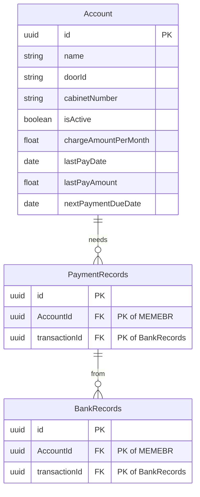

```mermaid
erDiagram
    %% CAR ||--o{ NAMED-DRIVER : allows
    %% CAR {
    %%     string allowedDriver FK "The license of the allowed driver"
    %%     string registrationNumber
    %%     string make
    %%     string model
    %% }
    %% PERSON ||--o{ NAMED-DRIVER : is
    %% PERSON {
    %%     string driversLicense PK "The license #"
    %%     string firstName
    %%     string lastName
    %%     int age
    %% }

    Account ||--o{ PaymentRecords : needs
    Account {
        uuid   id PK
        string name
        string doorId
        string cabinetNumber
        boolean isActive
        float chargeAmountPerMonth
        date lastPayDate
        float lastPayAmount
        date nextPaymentDueDate
    }
    PaymentRecords ||--o{ BankRecords : from
    PaymentRecords {
        uuid id PK
        uuid AccountId FK "PK of MEMEBR"
        uuid transactionId FK "PK of BankRecords"
    }
    BankRecords
    BankRecords {
        uuid id PK
        uuid AccountId FK "PK of MEMEBR"
        uuid transactionId FK "PK of BankRecords"
    }
```
